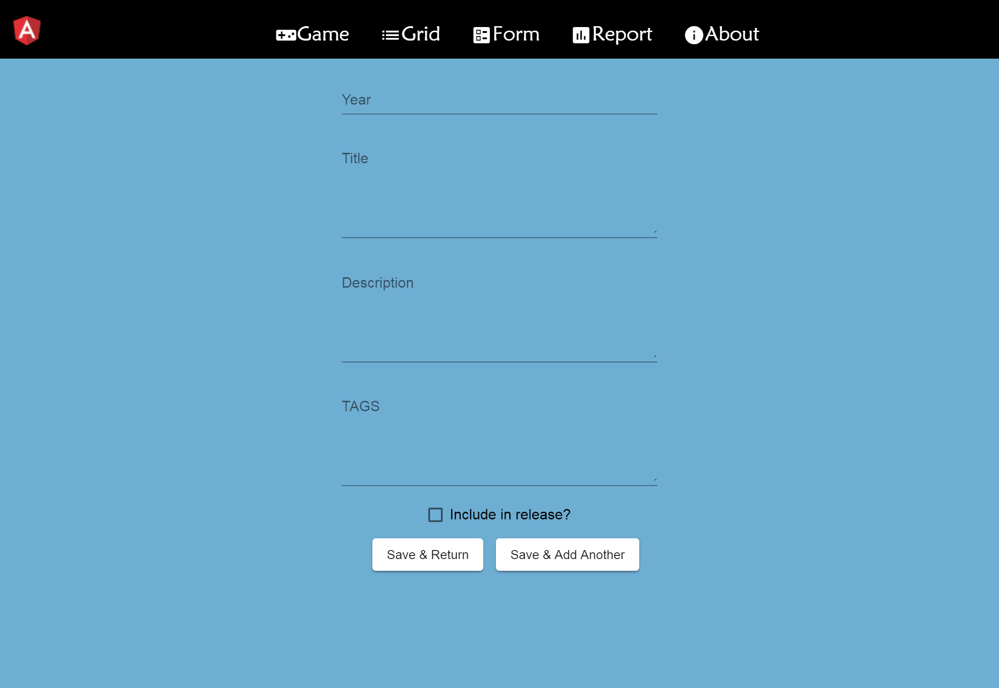
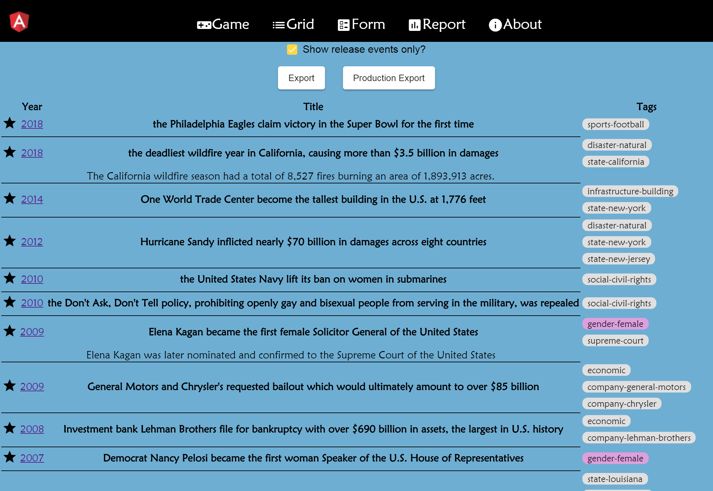
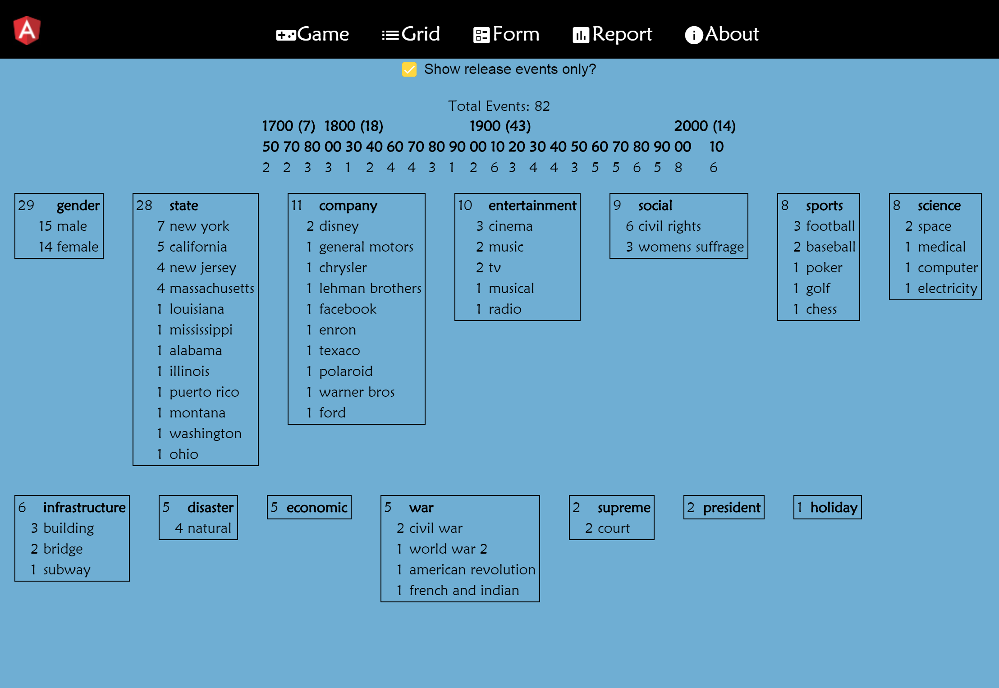

# Event Tag Editor

## Features
- Form
  - Year, Title, Description, Tags, isStarred
  - Save & Return To Grid, Save & Add Another
- Grid
  - Filter by isStarred
  - Provide character counts
- Report
  - Events by Decade
  - Events by Tags

<table>
    <tr>
        <td></td>
        <td></td>
    </tr>
    <tr>
        <td colspan="2"></td>
    </tr>
</table>

Data exported as json array of events which captures all current application state.

## Future Features
- Replace isStarred with category packs "Original", "World History 1990s", "Music Trivia 00s"
- Search by Category Tag. Clickable category names on report produce items.
- Language support with foreign pronunciation
- Image support

## Development server

Angular front-end with data being read from `./src/data/events.json` and then held in memory via `src/app/event/event.service`.
Run `ng serve` for a dev server. Navigate to `http://localhost:4200/`. The app will automatically reload if you change any of the source files.
